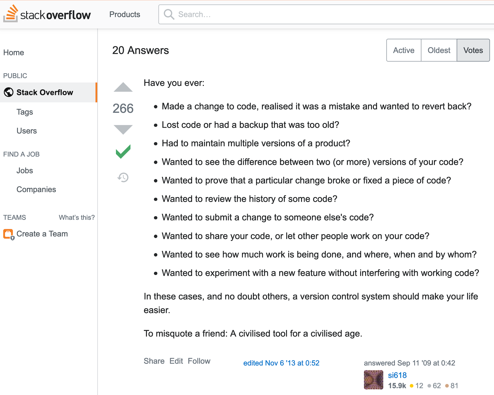
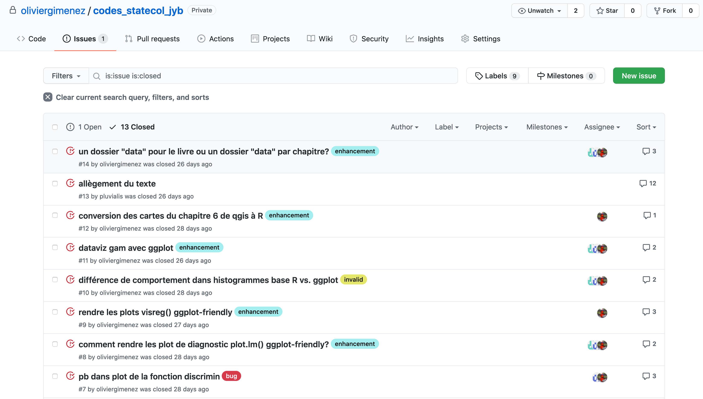
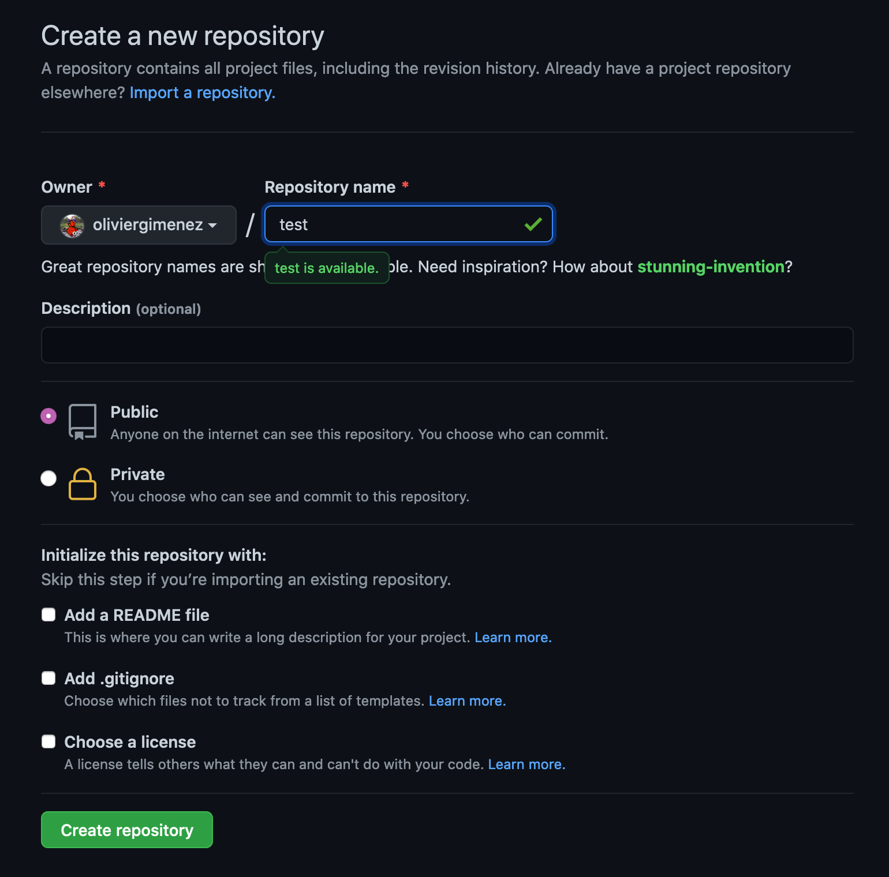
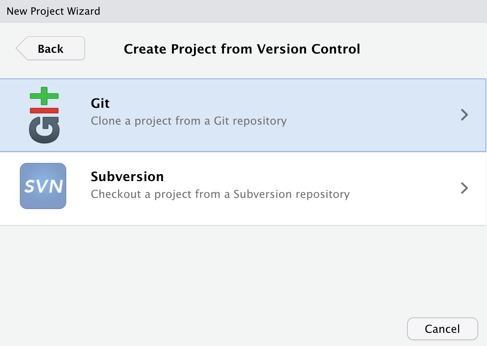
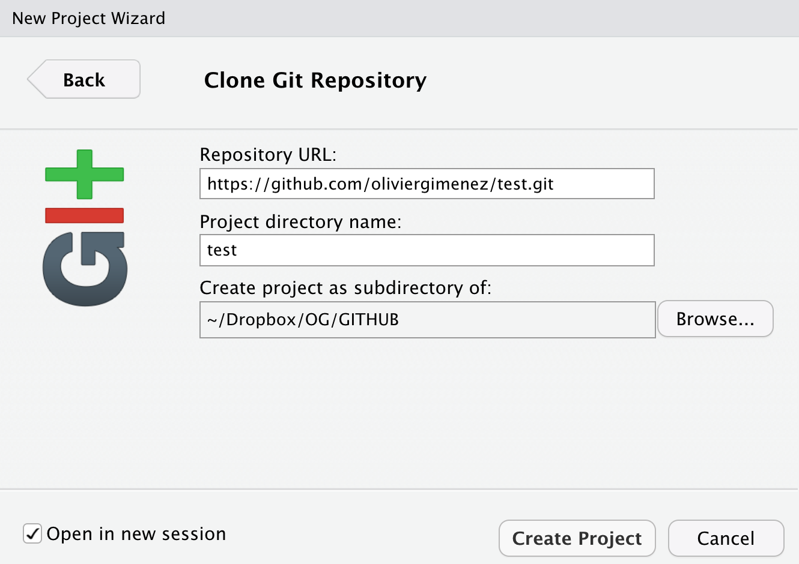
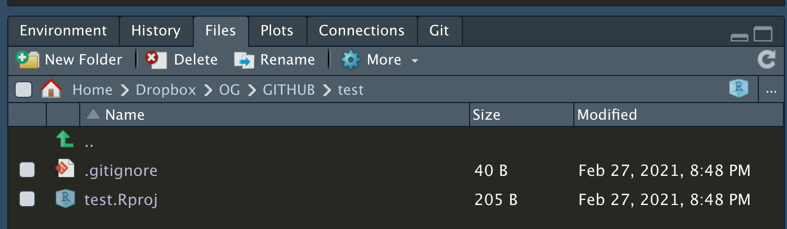

layout: true

```{r setup, include=FALSE}
knitr::opts_chunk$set(echo = TRUE)
library(magrittr)
```

---

# Rings a bell? 

<center>


 
</center>
 


---

# Version Control

### What is it? 

The **management of changes** to documents, computer programs,  websites, etc...

### Git 

Free to use **version control software**

If Dropbox and the "Track changes" feature in MS Word had a baby, that would be Git (Alexa Fredston)

### GitHub 

A **website** (https://github.com/) to **store your Git repositories online** and makes it easy to collaborate with others

You do not need GitHub to use Git, just like you do not need RStudio to run R (Alexa Fredston)


---
# [Why use version control?](https://stackoverflow.com/questions/1408450/why-should-i-use-version-control/1408464#1408464)

.center[

]


---

# Git, Github & RStudio

#### Before: Git only through the terminal `r emo::ji("cry")`

--

***

## Now RStudio allows using `Git` & `GitHub` `r emo::ji("star_struck")`

.center[

]


---
# Configure Git & GitHub

### Configure Git

**Check your configuration**

```{r, eval = FALSE}
usethis::git_sitrep()
```

**Set your configuration**

Use your github username and the email you used to sign-up on GitHub

```{r, eval = FALSE}
usethis::use_git_config(
    user.name = "oliviergimenez",
    user.email = "olivier.gimenez@cefe.cnrs.fr")
```

---
# Configure GitHub authentication

### Get GITHUB Personal Authorisation Token

```{r, eval = F}
usethis::create_github_token()
```


---

### Store in `.Renviron` file

```{r, eval = F}
usethis::edit_r_environ()
```


---

# RStudio Projects

## Use RStudio projects to keep materials associated with a particular analysis together

<br>
 
.pull-left[
- **Self contained** and **portable**
- **Working directory set to root** of project on launch
- **Fresh session** everytime the project is launched

See Jenny Bryan's post on [**project oriented workflows**](https://www.tidyverse.org/articles/2017/12/workflow-vs-script/) for more details
]

.pull-right.center[

**File > New Project > New Directory**


]


---
# Initialise git


### Initialise **RStudio project** with Git by **just checking a box!**

It's now **a repository**


---
# Git panel

## Integrated graphical user interface

<br>

.center[

]


---
# Git terms

* **repository** your project folder
<br>
* **commit** a snapshot of your repo
<br>
* **push** send commits to a remote
<br>
* **pull** get commits from a remote

<br>

* (*clone* get the repository from the remote for the first time)
* (*branch* a movable label that points to a commit)
* (*merge* combining two branches)
* (*remote* a computer with the repository on it)

---
# Git RStudio workflow

.pull-left[
#### view file status


#### stage files

]

.pull-right[
#### commit changes

]
---

# Share on GitHub

#### Create repo

Via GitHub or using package `usethis` w/ `usethis::use_github(protocol = "https")`


#### Push further changes


---

# Anatomy of a GitHub repo

- **`README`**. Explain what your project is, and how to use it. 
  + `usethis::use_readme_md()`
  + `usethis::use_readme_rmd()`

- **`LICENSE`**. Without a licence, the contents of the repository are technically closed. 
  + Examples licence [MIT](https://tldrlegal.com/license/mit-license): `usethis::use_mit_license(name = "Olivier Gimenez")`
  + `?licenses`: details of functions available to generate licenses
  + [https://choosealicense.com/](https://choosealicense.com/) help on choosing a licence.

    
---

# Anatomy of a GitHub repo


- **`CONTRIBUTING.md`** - guidelines for contributors.
  + `usethis::use_tidy_contributing()` provides a realtively strict but instructive template

- **`CODE_OF_CONDUCT.md`** set the tone for discourse between contributors. 
  + `use_code_of_conduct()`


---
# GitHub issues

### Use so-called issues to plan, record and discuss tasks



---

# Why using a remote like GitHub ?

* A backup of your repository

* Keep track of all changes, and possibility to rollback to a previous state

* Increase your visibility 

* Easy distribution of packages (without CRAN submissions)

* Work with others (not [fully] covered)

* Increase interactions with users (issues, pull requests)


---

# Working with others

* Use issues to talk to repo holders: propose changes, report bugs, etc...

* If you're a collaborator, clone the repo, do modifications and push them
* If you're not a collaborator, fork, clone then use pull requests

* Branches allow playing around without messing around with the main line of development
    + Allow exploring several versions of an idea, and switching between them
    + A branch should correspond to a bug fix, a new feature, etc.
    + Useful when unsure when/if some modifications will be included

.center[

]

* Resolving conflicts: see practical

---
# Further reading

* The bible: [Happy Git and GitHub for the useR](https://happygitwithr.com/)

* See also: [Hadley Wickham R packages book](https://r-pkgs.org/git.html)

* And in French: [Travailler avec Git via RStudio et versionner son code](https://thinkr.fr/travailler-avec-git-via-rstudio-et-versionner-son-code/)

---
# My two-cent workflow

<br><br>

<center>


 
</center>


---
# Create a new repository on GitHub

<br><br>

<center>


 
</center>

---
# Name and Public/Private

<center>


 
</center>


---
# Copy https

<br><br>

<center>


 
</center>


---
# In RStudio, File/New Project

<br><br>

<center>


 
</center>


---
# Select Version Control

<br>

<center>


 
</center>


---
# Select Git

<br><br>

<center>


 
</center>


---
# Clone your repo (remote to local)

<center>


 
</center>


---
# Stage, commit and push

<br><br>

<center>


 
</center>

---
# Alternative is to go local first

<br>

* Step 1: Use RStudio projects (possibility to create a project from an existing directory)

* Step 2: `usethis::use_git()` and follow instructions

* Step 3: `usethis::use_github()` and follow instructions
