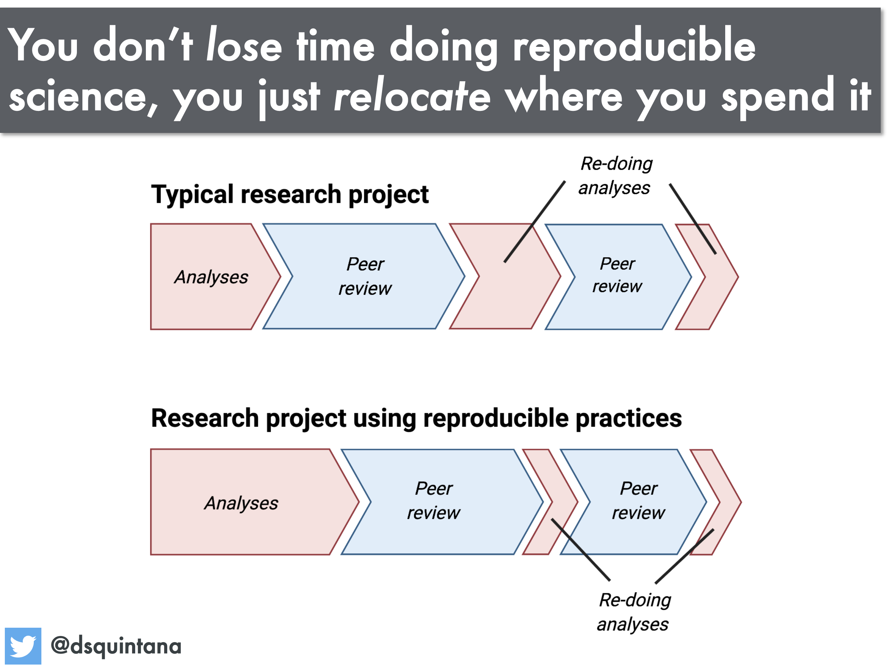

```{r setup, include=FALSE, echo=FALSE}
options(htmltools.dir.version = FALSE)
knitr::opts_chunk$set(comment = "")
```

class: inverse, center, middle
# The problems

---
<iframe width="1200" height="500" src="https://www.youtube.com/embed/s3JldKoA0zw" frameborder="0" allow="accelerometer; autoplay; encrypted-media; gyroscope; picture-in-picture" allowfullscreen></iframe>

Credit: [Ignasi Bartomeus, PhD](https://bartomeuslab.com/)

---

<center>


</center>


---
class: inverse, center, middle
# Why reproducible science?


---


<center>


</center>


---


<center>


</center>


---
class: inverse, center, middle
# What?

---


<center>


</center>


---
class: inverse, center, middle
# Benefits?

---

# Among other advantages

* Forces you to double-check your stuff (you share data and code)

* Your future-self will thank you (repeat analyses, write papers)

* By being reproducible, you build up your credibility and reputation (good for CV)

* Reproducibility is trust in some ways

* Faster scientific progress 

---


<center>



</center>

---
class: inverse, center, middle
# How?

---
## How can you reproduce results?

.center[]


---
## What do we need to make research reproducible?

- Data in some coherent format 

- Non-proprietary programming language (R, Python)

- Text, figures and code in same environment

- An environment that allows continuous and transparent editions and updates

- An explicit workflow


---
## This workshop

* Manipulating data in the `tidyverse`   

* Visualising data in the `tidyverse`   

* Writing dynamic and reproducible documents with `R Markdown`  

* Versioning with `Git` and `GitHub` in `RStudio`   

* Take-home messages    


---

## Further reading

*  Alston & Rick (2021). A Beginner's Guide to Conducting Reproducible Research. Bull Ecol Soc Am. https://doi.org/10.1002/bes2.1801 
* Baker (2016). 1,500 scientists lift the lid on reproducibility. Nature. 533:452-4. https://www.nature.com/news/1-500-scientists-lift-the-lid-on-reproducibility-1.19970
* Lowndes et al. (2017). Our path to better science in less time using open data science tools. Nat Ecol Evol 1:0160. https://doi.org/10.1038/s41559-017-0160
* Wilson et al. (2017). Good enough practices in scientific computing. PLoS Comput Biol 13(6): e1005510. https://doi.org/10.1371/journal.pcbi.1005510
* Markowetz (2015). Five selfish reasons to work reproducibly. Genome Biol 16: 274. https://doi.org/10.1186/s13059-015-0850-7.
* BES Guides to Better Science: Reproducible Code. https://www.britishecologicalsociety.org/wp-content/uploads/2019/06/BES-Guide-Reproducible-Code-2019.pdf


