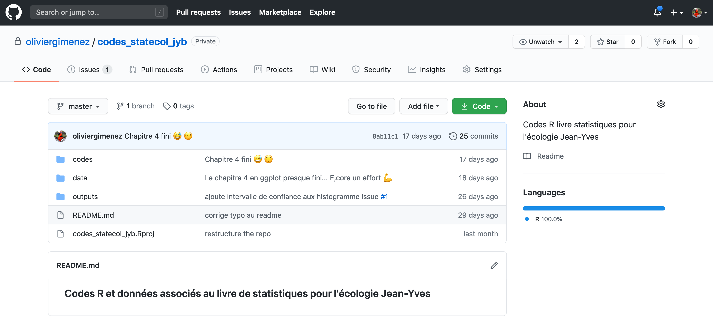

layout: true

```{r setup, include=FALSE}
knitr::opts_chunk$set(echo = FALSE)
library(magrittr)
```

---

# Rings a bell? 

<center>


 
</center>
 


---

# Version Control

### What is it? `r emo::ji("thinking")`

The **management of changes** to documents, computer programs, large web sites, and other collections of information.

### Git 

Open source (free to use) **Version control software.**

### GitHub 

A **website** (https://github.com/) that allows you to **store your Git repositories online** and makes it easy to collaborate with others.

---

# Git, Github & RStudio

#### Before: git only through the terminal `r emo::ji("cry")`

--

***

## Now: RStudio == `r emo::ji("heart")` `Git` & `GitHub` `r emo::ji("star_struck")`

.center[

]


---
# Configure git & GitHub

### Configure git

**Check your configuration**

```{r, eval=FALSE}
usethis::git_sitrep()
```


**Set your configuration**

Use your github username and the email you used to sign-up on GitHub

```{r, eval=FALSE}
usethis::use_git_config(
    user.name = "Jane",
    user.email = "jane@example.org")
```

---
# Configure GitHub authentication

### Get GITHUB Personal Authorisation Token

```{r, eval=F}
usethis::browse_github_pat()
```


---

### Store in `.Renviron` file

```{r, eval=F}
usethis::edit_r_environ()
```


---
# Initialise git


### Initialise **RStudio project** with Git by **just checking a box!**

It's now **a repository**


---

# RStudio Projects

## Use RStudio projects to keep materials associated with a particular analysis together

<br>
 
.pull-left[
- **Self contained** and **portable**
- **Working directory set to root** of project on launch
- **Fresh session** everytime the project is launched

See Jenny Bryan's post on [**project oriented workflows**](https://www.tidyverse.org/articles/2017/12/workflow-vs-script/) for more details
]

.pull-right.center[

**File > New Project > New Directory**


]


---
# Git panel

## Integrated graphical user interface

<br>

.center[

]


---
# Git terms

* **repository** your project folder
<br>
* **commit** a snapshot of your repo
<br>
* **push** send commits to a remote
<br>
* **pull** get commits from a remote

<br>

* (*clone* get the repository from the remote for the first time)
* (*branch* a movable label that points to a commit)
* (*merge* combining two branches)
* (*remote* a computer with the repository on it)

---
# Git RStudio workflow

.pull-left[
#### view file status


#### stage files

]

.pull-right[
#### commit changes

]
---

# Share on GitHub

#### Create repo


```{r, eval=FALSE}
usethis::use_github(protocol = "https")
```



#### Push further changes


---

# Anatomy of a GitHub repo

- **`README`**. Explain what your project is, and how to use it. 
  + `usethis::use_readme_md()`
  + `usethis::use_readme_rmd()`

- **`LICENSE`**. Without a licence, the contents of the repository are technically closed. 
  + Examples licence [MIT](https://tldrlegal.com/license/mit-license): `usethis::use_mit_license(name = "Olivier Gimenez")`
  + `?licenses`: details of functions available to generate licenses
  + [https://choosealicense.com/](https://choosealicense.com/) help on choosing a licence.

    
---

# Anatomy of a GitHub repo


- **`CONTRIBUTING.md`** - guidelines for contributors.
  + `usethis::use_tidy_contributing()` provides a realtively strict but instructive template

- **`CODE_OF_CONDUCT.md`** set the tone for discourse between contributors. 
  + `use_code_of_conduct()`


---
# GitHub issues

### use GitHub issues to plan, record and discuss tasks.


---

# Why using a remote like GitHub ?

* A backup of your repository

* Work with others (not covered)

* Increase your visibility 

* Increase interactions with users

* Easy distribution of packages (without CRAN submissions)

