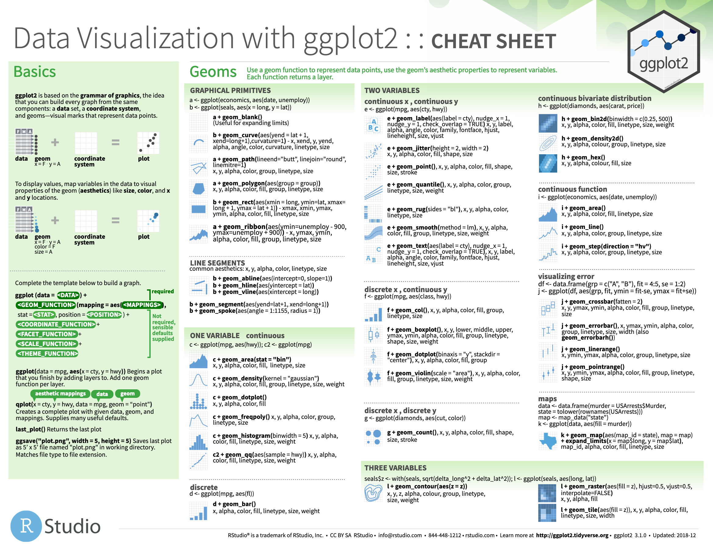
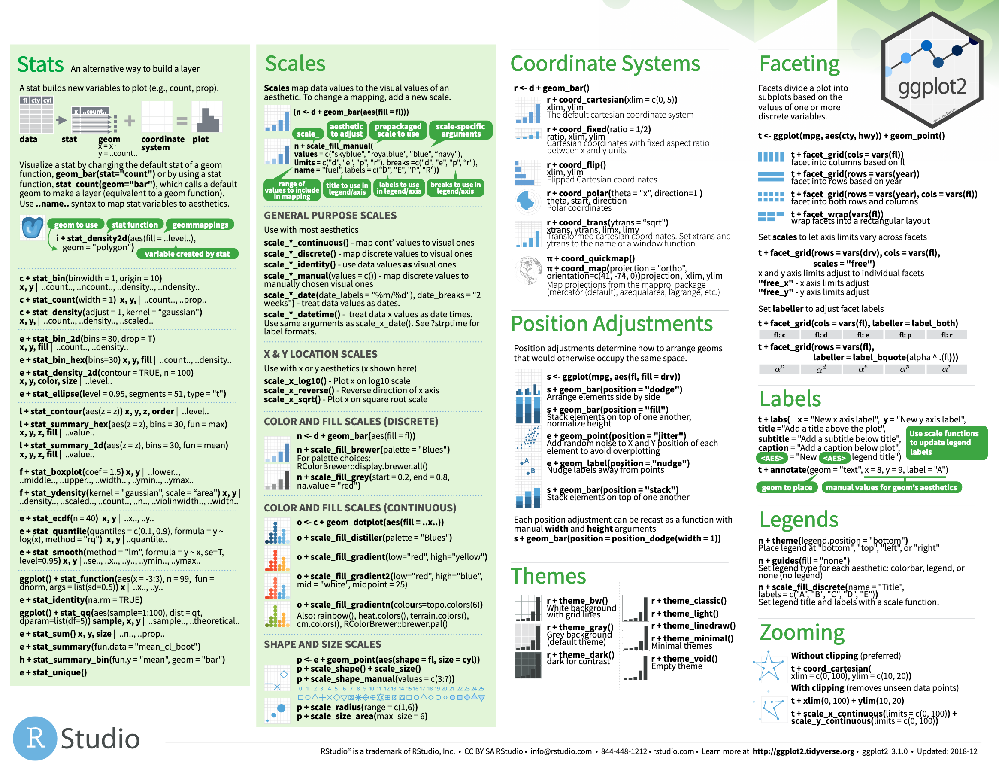

```{r global_options, include=FALSE}
knitr::opts_chunk$set(fig.path = 'assets/chunks/', cache.path = "assets/cache/", dpi = 300)
library(tidyverse)
theme_set(theme_grey(base_size = 16))
library(emo)
#devtools::install_github("ropenscilabs/icon")
#devtools::install_github("hadley/emo")
citations_raw <- read_csv('https://raw.githubusercontent.com/oliviergimenez/intro_tidyverse/master/journal.pone.0166570.s001.CSV')
citations <- citations_raw %>% #<<
  rename(journal = 'Journal identity',
       impactfactor = '5-year journal impact factor',
       pubyear = 'Year published',
       colldate = 'Collection date',
       pubdate = 'Publication date',
       nbtweets = 'Number of tweets',
       woscitations = 'Number of Web of Science citations') %>%
  mutate(journal = as.factor(journal))
```


# Visualization with ggplot2

* The package ggplot2 implements a **g**rammar of **g**raphics

* Operates on data.frames or tibbles, not vectors like base R

* Explicitly differentiates between the data and its representation

```{r echo=FALSE, out.width = "30%", fig.align="center"}
knitr::include_graphics("assets/img/ggplot2_logo.jpg")
```

---

# The ggplot2 grammar


 Grammar element   | What it is
 :---------------- | :-----------------------------
 **Data**          | The data frame being plotted
 **Geometrics**    | The geometric shape that will represent the data
                   | (e.g., point, boxplot, histogram)
 **Aesthetics**    | The aesthetics of the geometric object
                   | (e.g., color, size, shape)


```{r echo=FALSE, out.width = "30%", fig.align="center"}
knitr::include_graphics("assets/img/ggplot2_logo.jpg")
```


---

# Scatterplots

```{r message=FALSE, warning=FALSE, paged.print=FALSE, out.width = '400cm', out.height='400cm', fig.align = "center", eval=FALSE}
citations %>%  #<<
  ggplot() + #<<
  aes(x = nbtweets, y = woscitations) +
  geom_point()
```
* Pass in the data frame as your first argument

---

# Scatterplots

```{r message=FALSE, warning=FALSE, paged.print=FALSE, out.width = '400cm', out.height='400cm',  fig.align = "center", eval=FALSE}
citations %>%
  ggplot() +
  aes(x = nbtweets, y = woscitations) + #<<
  geom_point()
```
* Pass in the data frame as your first argument
* Aesthetics maps the data onto plot characteristics, here x and y axes

---

# Scatterplots

```{r message=FALSE, warning=FALSE, paged.print=FALSE, out.width = '400cm', out.height='400cm',  fig.align = "center", eval=FALSE}
citations %>%
  ggplot() +
  aes(x = nbtweets, y = woscitations) +
  geom_point() #<<
```
* Pass in the data frame as your first argument
* Aesthetics maps the data onto plot characteristics, here x and y axes
* Display the data geometrically as points


---

# Scatterplots

```{r message=FALSE, warning=FALSE, paged.print=FALSE, out.width = '400cm', out.height='400cm', fig.align = "center"}
citations %>%
  ggplot() +
  aes(x = nbtweets, y = woscitations) +
  geom_point()
```


---

# Scatterplots, with colors

```{r message=FALSE, warning=FALSE, paged.print=FALSE, out.width = '400cm', out.height='400cm',  fig.align = "center"}
citations %>%
  ggplot() +
  aes(x = nbtweets, y = woscitations) +
  geom_point(color = "red") #<<
```

---

# Scatterplots, with species-specific colors

```{r message=FALSE, warning=FALSE, paged.print=FALSE, out.width = '400cm', out.height='400cm',  fig.align = "center"}
citations %>%
  ggplot() +
  aes(x = nbtweets, y = woscitations, color = journal) + #<<
  geom_point()
```

* Placing color inside aesthetic maps it to the data


---

# Pick a few journals

```{r message=FALSE, warning=FALSE, paged.print=FALSE, out.width = '400cm', out.height='400cm',  fig.align = "center"}
citations_ecology <- citations %>%
  mutate(journal = str_to_lower(journal)) %>% # all journals names lowercase
  filter(journal %in%
           c('journal of animal ecology','journal of applied ecology','ecology')) # filter
citations_ecology
```


---

# Scatterplots, with species-specific shapes

```{r message=FALSE, warning=FALSE, paged.print=FALSE, out.width = '400cm', out.height='400cm',  fig.align = "center"}
citations_ecology %>%
  ggplot() +
  aes(x = nbtweets, y = woscitations, shape = journal) + #<<
  geom_point(size=2)
```

---

# Scatterplots, lines instead of points

```{r message=FALSE, warning=FALSE, paged.print=FALSE, out.width = '350cm', out.height='350cm',  fig.align = "center"}
citations_ecology %>%
  ggplot() +
  aes(x = nbtweets, y = woscitations) +
  geom_line() + #<<
  scale_x_log10()
```

---

# Scatterplots, lines with sorting beforehand

```{r message=FALSE, warning=FALSE, paged.print=FALSE, out.width = '350cm', out.height='350cm',  fig.align = "center"}
citations_ecology %>%
  arrange(woscitations) %>% #<<
  ggplot() +
  aes(x = nbtweets, y = woscitations) +
  geom_line() +
  scale_x_log10()
```

---

# Scatterplots, add points

```{r message=FALSE, warning=FALSE, paged.print=FALSE, out.width = '350cm', out.height='350cm',  fig.align = "center"}
citations_ecology %>%
  ggplot() +
  aes(x = nbtweets, y = woscitations) +
  geom_line() +
  geom_point() + #<<
  scale_x_log10()
```

---

# Scatterplots, add linear trend

```{r message=FALSE, warning=FALSE, paged.print=FALSE, out.width = '350cm', out.height='350cm',  fig.align = "center"}
citations_ecology %>%
  ggplot() +
  aes(x = nbtweets, y = woscitations) +
  geom_point() +
  geom_smooth(method = "lm") + #<<
  scale_x_log10()
```

---

# Scatterplots, add smoother

```{r message=FALSE, warning=FALSE, paged.print=FALSE, out.width = '350cm', out.height='350cm',  fig.align = "center"}
citations_ecology %>%
  ggplot() +
  aes(x = nbtweets, y = woscitations) +
  geom_point() +
  geom_smooth() + #<<
  scale_x_log10()
```

---

# aes or not aes?

* If we are to establish a link between the values of a variable and a graphical feature, ie a mapping, then we need an aes().

* Otherwise, the graphical feature is modified irrespective of the data, then we do not need an aes().

```{r echo=FALSE, out.width = "30%", fig.align="center"}
knitr::include_graphics("assets/img/ggplot2_logo.jpg")
```

---

# Histograms

```{r message=FALSE, warning=FALSE, paged.print=FALSE, out.width = '400cm', out.height='400cm',  fig.align = "center"}
citations_ecology %>%
  ggplot() +
  aes(x = nbtweets) +
  geom_histogram() #<<
```

---

# Histograms, with colors

```{r message=FALSE, warning=FALSE, paged.print=FALSE, out.width = '400cm', out.height='400cm',  fig.align = "center"}
citations_ecology %>%
  ggplot() +
  aes(x = nbtweets) +
  geom_histogram(fill = "orange") #<<
```

---

# Histograms, with colors

```{r message=FALSE, warning=FALSE, paged.print=FALSE, out.width = '400cm', out.height='400cm',  fig.align = "center"}
citations_ecology %>%
  ggplot() +
  aes(x = nbtweets) +
  geom_histogram(fill = "orange", color = "brown") #<<
```

---

# Histograms, with labels and title

```{r message=FALSE, warning=FALSE, paged.print=FALSE, out.width = '350cm', out.height='350cm',  fig.align = "center"}
citations_ecology %>%
  ggplot() +
  aes(x = nbtweets) +
  geom_histogram(fill = "orange", color = "brown") +
  labs(x = "Number of tweets", #<<
       y = "Count", #<<
       title = "Histogram of the number of tweets") #<<
```

---

# Histograms, by species

```{r message=FALSE, warning=FALSE, paged.print=FALSE, out.width = '300cm', out.height='300cm',  fig.align = "center"}
citations_ecology %>%
  ggplot() +
  aes(x = nbtweets) +
  geom_histogram(fill = "orange", color = "brown") +
  labs(x = "Number of tweets",
       y = "Count",
       title = "Histogram of the number of tweets") + 
  facet_wrap(vars(journal)) #<<
```

---

# Boxplots

```{r message=FALSE, warning=FALSE, paged.print=FALSE, out.width = '350cm', out.height='350cm',  fig.align = "center"}
citations_ecology %>%
  ggplot() +
  aes(x = "", y = nbtweets) +
  geom_boxplot() + #<<
  scale_y_log10()
```

---

# Boxplots with colors

```{r message=FALSE, warning=FALSE, paged.print=FALSE, out.width = '350cm', out.height='350cm',  fig.align = "center"}
citations_ecology %>%
  ggplot() +
  aes(x = "", y = nbtweets) +
  geom_boxplot(fill = "green") + #<<
  scale_y_log10()
```

---

# Boxplots with colors by species

```{r message=FALSE, warning=FALSE, paged.print=FALSE, out.width = '300cm', out.height='300cm',  fig.align = "center"}
citations_ecology %>%
  ggplot() +
  aes(x = journal, y = nbtweets, fill = journal) + #<<
  geom_boxplot() +
  scale_y_log10()
```


---

# Get rid of the ticks on x axis

```{r message=FALSE, warning=FALSE, paged.print=FALSE, out.width = '300cm', out.height='300cm',  fig.align = "center"}
citations_ecology %>%
  ggplot() +
  aes(x = journal, y = nbtweets, fill = journal) +
  geom_boxplot() +
  scale_y_log10() + 
  theme(axis.text.x = element_blank()) + #<<
  labs(x = "") #<<
```


---

# Boxplots, user-specified colors by species

```{r message=FALSE, warning=FALSE, paged.print=FALSE, out.width = '300cm', out.height='300cm',  fig.align = "center"}
citations_ecology %>%
  ggplot() +
  aes(x = journal, y = nbtweets, fill = journal) +
  geom_boxplot() +
  scale_y_log10() +
  scale_fill_manual( #<<
    values = c("red", "blue", "purple")) + #<<
  theme(axis.text.x = element_blank()) +
  labs(x = "")

```

---

# Boxplots, change legend settings

```{r message=FALSE, warning=FALSE, paged.print=FALSE, out.width = '270cm', out.height='270cm',  fig.align = "center"}
citations_ecology %>%
  ggplot() +
  aes(x = journal, y = nbtweets, fill = journal) +
  geom_boxplot() +
  scale_y_log10() +
  scale_fill_manual( #<<
    values = c("red", "blue", "purple"),
    name = "Journal name", #<<
    labels = c("Ecology", "J Animal Ecology", "J Applied Ecology")) + #<<
  theme(axis.text.x = element_blank()) +
  labs(x = "")
```


---

# Ugly bar plots

```{r message=FALSE, warning=FALSE, paged.print=FALSE, out.width = '350cm', out.height='350cm',  fig.align = "center"}
citations %>%
  count(journal) %>%
  ggplot() +
  aes(x = journal, y = n) +
  geom_col() #<<
```

---

# Idem, with flipping

```{r message=FALSE, warning=FALSE, paged.print=FALSE, out.width = '350cm', out.height='350cm',  fig.align = "center"}
citations %>%
  count(journal) %>%
  ggplot() +
  aes(x = n, y = journal) + #<<
  geom_col()
```


---

# Idem, with factors reordering and flipping

```{r message=FALSE, warning=FALSE, paged.print=FALSE, out.width = '350cm', out.height='350cm',  fig.align = "center"}
citations %>%
  count(journal) %>%
  ggplot() +
  aes(x = n, y = fct_reorder(journal, n)) + #<<
  geom_col()
```


---

# Further cleaning

```{r message=FALSE, warning=FALSE, paged.print=FALSE, out.width = '350cm', out.height='350cm',  fig.align = "center"}
citations %>%
  count(journal) %>%
  ggplot() +
  aes(x = n, y = fct_reorder(journal, n)) +
  geom_col() + 
  labs(x = "counts", y = "")
```


---

# More about how to (tidy) work with factors 

* [Be the boss of your factors](https://stat545.com/block029_factors.html) and 
* [forcats, forcats, vous avez dit forcats ?](https://thinkr.fr/forcats-forcats-vous-avez-dit-forcats/).


---

# Density plots

```{r message=FALSE, warning=FALSE, paged.print=FALSE, out.width = '350cm', out.height='350cm',  fig.align = "center"}
citations_ecology %>%
  ggplot() +
  aes(x = nbtweets, fill = journal) +
  geom_density() +#<<
  scale_x_log10()
```

---

# Density plots, control transparency

```{r message=FALSE, warning=FALSE, paged.print=FALSE, out.width = '350cm', out.height='350cm',  fig.align = "center"}
citations_ecology %>%
  ggplot() +
  aes(x = nbtweets, fill = journal) +
  geom_density(alpha = 0.5) +#<<
  scale_x_log10()
```

---

# Change default background 

```{r message=FALSE, warning=FALSE, paged.print=FALSE, out.width = '300cm', out.height='300cm',  fig.align = "center"}
# `B & W theme`
citations_ecology %>%
  ggplot() +
  aes(x = nbtweets, fill = journal) +
  geom_density(alpha = 0.5) +
  scale_x_log10() +
  theme_bw() #<< 
```

---

# Change default background theme 

```{r message=FALSE, warning=FALSE, paged.print=FALSE, out.width = '300cm', out.height='300cm',  fig.align = "center"}
# `classic theme`
citations_ecology %>%
  ggplot() +
  aes(x = nbtweets, fill = journal) +
  geom_density(alpha = 0.5) +
  scale_x_log10() +
  theme_classic() #<< 
```

---

# Change default background theme 

```{r message=FALSE, warning=FALSE, paged.print=FALSE, out.width = '300cm', out.height='300cm',  fig.align = "center"}
# `dark theme`
citations_ecology %>%
  ggplot() +
  aes(x = nbtweets, fill = journal) +
  geom_density(alpha = 0.5) +
  scale_x_log10() +
  theme_dark() #<<
```


---

# More on data visualisation with ggplot2


* [Portfolio](https://www.r-graph-gallery.com/portfolio/ggplot2-package/) of ggplot2 plots

* [Cédric Scherer's portfolio](https://cedricscherer.netlify.app/top/dataviz/) of data visualisations

* [Top](http://r-statistics.co/Top50-Ggplot2-Visualizations-MasterList-R-Code.html) ggplot2 visualizations

* [Interactive](https://dreamrs.github.io/esquisse/) ggplot2 visualizations


```{r echo=FALSE, out.width = "30%", fig.align="center"}
knitr::include_graphics("assets/img/ggplot2_logo.jpg")
```


---

background-image: url(https://github.com/rstudio/hex-stickers/raw/master/SVG/tidyverse.svg?sanitize=true)
background-size: 550px
background-position: 50% 50%


---

# To dive deeper in data visualisation with the tidyverse

* [Learn the tidyverse](https://www.tidyverse.org/learn/): books, workshops and online courses


* My selection of books:
   - [R for Data Science](https://r4ds.had.co.nz/) et [Advanced R](http://adv-r.had.co.nz/)
   - [Introduction à R et au tidyverse](https://juba.github.io/tidyverse/)
   - [Fundamentals of Data visualization](https://clauswilke.com/dataviz/)
   - [Data Visualization: A practical introduction](http://socviz.co/)


* [Tidy Tuesdays videos](https://www.youtube.com/user/safe4democracy/videos) by D. Robinson 

* Material of the [2-day workshop Data Science in the tidyverse](https://github.com/cwickham/data-science-in-tidyverse) held at the RStudio 2019 conference

* Material of the stat545 course on [Data wrangling, exploration, and analysis with R](https://stat545.com/) at the University of British Columbia

---

# The [RStudio Cheat Sheets](https://www.rstudio.com/resources/cheatsheets/)

```{r echo=FALSE, message=FALSE, warning=FALSE, paged.print=FALSE, out.width = "600px", fig.align = "center"}

```

---

# The [RStudio Cheat Sheets](https://www.rstudio.com/resources/cheatsheets/)

```{r echo=FALSE, message=FALSE, warning=FALSE, paged.print=FALSE, out.width = "600px", fig.align = "center"}

```

