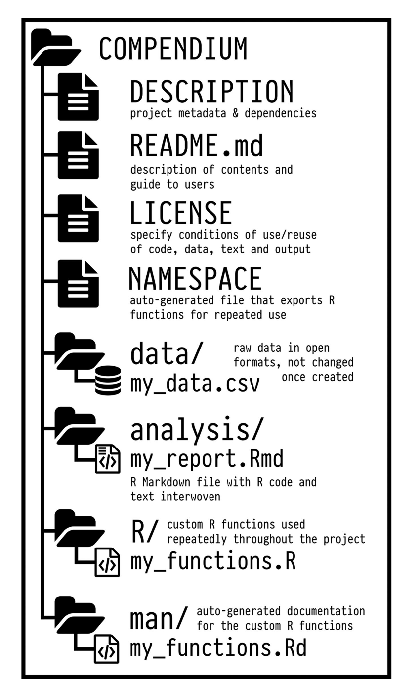

```{r setup, include=FALSE, echo=FALSE}
options(htmltools.dir.version = FALSE)
knitr::opts_chunk$set(comment = "")
```


# Virtuous research cycle

<center>


</center>


---

# Workflow

* Use tidy data format with `tidyverse`

* Prefer .csv or .txt, do not modify original file, use scripts instead

* Write functions instead of repeating yourself

* Version control with `Git` and `GitHub` (easy in `RStudio`)

* Literate programming with `RMarkdown` (makes it easy to comment code)

* Organise and share your stuff in research compendia

---

# Research compendium (1/3)

* a single file of `R` code with in-line comments documenting the  workflow

* a `R Markdown` file with text and code in the same source document, and accompanyingdata files

---

# Research compendium (2/3)

* as project grows, more structure is needed

<center>


</center>

---

# Research compendium (2/3)

* as project grows, more structure is needed

<center>


</center>


---

# Research compendium (2/3)

* as project grows, more structure is needed

<center>



</center>


---

# Research compendium (3/3)

* Marwick, Boettiger & Mullen (2018). [Packaging Data Analytical Work Reproducibly Using R (and Friends)](https://peerj.com/preprints/3192/). The American Statistician 72: 80-88.

* Use package `rrtools`

* Further reading: https://research-compendium.science/ 

---

# Further reproducility, automate your process

* Build your own package (pointers [here](https://support.rstudio.com/hc/en-us/articles/200486488-Developing-Packages-with-RStudio))

* Use pipeline toolkits with `targets` (see [here](https://ropensci.org/blog/2021/02/03/targets/) and [there](https://books.ropensci.org/targets/))

* Build an image of your working environment with  [Docker](https://environments.rstudio.com/docker) 


---

# Closing remarks

* You do not need to adopt all these practices at once

* Reproducibility is a gradient (think of the different levels of research compendium)

* Little by little is fine 

* Already great to set your mind in that direction


